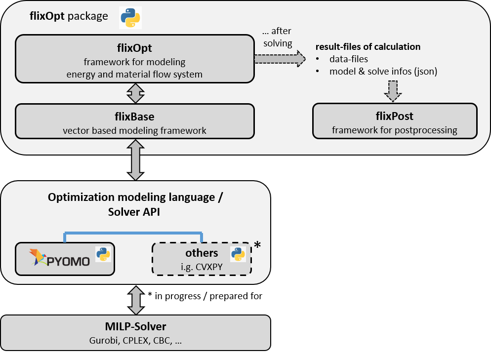

# flixOpt Concepts Overview

flixOpt is built around a set of core concepts that work together to represent and optimize energy and material flow systems. This page provides a high-level overview of these concepts and how they interact.

## Core Concepts

### FlowSystem

The `FlowSystem` is the central organizing unit in flixOpt. It:

- Defines the time series for the simulation
- Contains all components, buses, and flows
- Manages the effects (objectives and constraints)
- Coordinates the optimization process

Every flixOpt model starts with creating a FlowSystem.

### Buses

`Bus` objects represent nodes or connection points in your system. They:

- Balance incoming and outgoing flows
- Can represent physical networks like heat, electricity, or gas 
- Handles infeasable balances gently by allowing the balance to be closed in return for a big Penalty (optional)

### Flows

`Flow` objects represent the movement of energy or material between components and buses. They:

- Have a size (fixed or optimized as an investment decision)
- Can have fixed profiles (for demands or renewable generation)
- Can have constraints (min/max, total flow hours, etc.)
- Can have associated [Effects](#effects)

### Components

`Component` objects represent physical entities in your system that interact with flows. They include:

- `LinearConverter` - Converts input flows to output flows with (piecewise) linear relationships
- `Storage` - Stores energy or material over time
- `Source` / `Sink` - Produce or consume flows. They are usually used to model external demands or supplies.
- `Transmission` - Moves flows between locations with possible losses
- Specialized converters like `Boiler`, `HeatPump`, `CHP`, etc.

### Effects

`Effect` objects represent impacts or metrics related to your system, such as:

- Costs (investment, operation)
- Emissions (CO2, NOx, etc.)
- Resource consumption

These can be freely defined and crosslink to each other (CO2-Emissions ---(specific CO2-costs)---> Costs).
One effect is designated as the optimization objective (typically costs), while others can have constraints.
This effect can incorporate several other effects, which woul result in a weighted objective from multiple effects.

### Calculation Modes

flixOpt offers different calculation approaches:

- `FullCalculation` - Solves the entire problem at once
- `SegmentedCalculation` - Solves the problem in segments (with optioinal overlap), improving performance for large problems
- `AggregatedCalculation` - Uses typical periods to reduce computational requirements

## How These Concepts Work Together

1. You create a `FlowSystem` with a specified time series
2. You add elements to the FLowSystem:
    - `Bus` objects as connection points
    - `Component` objects like Boilers, Storages, etc.. They include `Flow` which define the connection to a Bus.
    - `Effect` objects to represent costs, emissions, etc.
6. You choose a calculation mode and solver
7. flixOpt converts your model into a mathematical optimization problem
8. The solver finds the optimal solution
9. You analyze the results with built-in or external tools

## Mathematical Foundation

Behind the scenes, flixOpt converts your Flow System into a mixed-integer linear programming (MILP) problem:
This is done using the [linopy package](https://github.com/PyPSA/linopy).

- Variables represent flow rates, storage levels, on/off states, etc.
- Constraints ensure physical validity (energy balance, etc.)
- The objective function represents the effect to be minimized (usually cost)

The mathematical formulation is flexible and can incorporates:

- Time-dependent parameters
- Investment decisions
- Binary decision variables (on/off decisions, piecewise linear relationships, ...)
- Runtime or downtime constraints
- and many more...

<!--## Next Steps-->
<!---->
<!--Now that you understand the basic concepts, learn more about each one:-->
<!---->
<!--- [FlowSystem](api/flow_system.md) - Time series and system organization-->
<!--- [Components](api/components.md) - Available component types and how to use them-->
<!--- [Effects](apieffects.md) - Costs, emissions, and other impacts-->
<!--- [Calculation Modes](api/calculation.md) - Different approaches to solving your model-->
